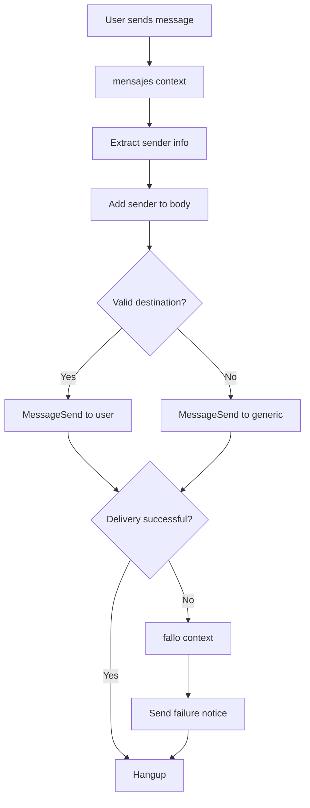

## Overview

Asterisk can route SIP text messages between users, creating a message center. This is **not instant messaging** but rather a store-and-forward message delivery system.

<Warning>
SIP messaging is different from instant messaging. Messages are delivered when possible, and the system provides delivery confirmation and failure notifications.
</Warning>

## Configuration Steps

### 1. Configure sip.conf

Enable SIP messaging in the SIP configuration:

```bash
sudo vim /etc/asterisk/sip.conf
```

**Add to the `[general]` section:**

```ini
;-----Para los mensajes-----
accept_outofcall_message=yes
outofcall_message_context=mensajes
auth_message_requests=yes
subscribecontext=suscribir
```

**Parameters explained:**
- **accept_outofcall_message=yes**: Accept messages outside of active calls
- **outofcall_message_context=mensajes**: Context to handle incoming messages
- **auth_message_requests=yes**: Require authentication for messages
- **subscribecontext=suscribir**: Context for presence subscriptions

### 2. Configure extensions.conf

Create the message handling logic in the dialplan:

```bash
sudo vim /etc/asterisk/extensions.conf
```

**Subscription context:**

```ini
[suscribir]
exten => 4000,hint,SIP/javier
exten => 4001,hint,SIP/belen
```

**Message routing context:**

```ini
[mensajes]
exten => _X.,1,NoOp(Mensaje de ${MESSAGE(from)})
same => n,NoOp(Mensaje para ${MESSAGE(to)})
same => n,NoOp(Cuerpo del mensaje: ${MESSAGE(body)})
same => n,Set(dest=${EXTEN})
same => n,Set(remitente=${CUT(MESSAGE(from),<,2)})
same => n,Set(remitente=${CUT(remitente,@,1)})
same => n,Set(remitente=${CUT(remitente,:,2)})
same => n,Set(texto=${MESSAGE(body)})
same => n,Set(MESSAGE(body)=${remitente}: ${texto})
same => n,GotoIf($["${EXTEN}" = "4000"]?4000)
same => n,GotoIf($["${EXTEN}" = "4001"]?4001)
same => n,MessageSend(${EXTEN}, Centro de Mensajes(CdM))
same => n,Noop(Estado del mensaje ${MESSAGE_SEND_STATUS})
same => n,GotoIf($["${MESSAGE_SEND_STATUS}" != "SUCCESS"]?fallo,s,1)
same => n,Hangup()

exten => 4000,4000,NoOp(Mensaje a Javier)
same => n,MessageSend(sip:javier, Centro de Mensajes(CdM))
same => n,Noop(Estado del mensaje ${MESSAGE_SEND_STATUS})
same => n,GotoIf($["${MESSAGE_SEND_STATUS}" != "SUCCESS"]?fallo,s,1)
same => n,Hangup()

exten => 4001,4001,NoOp(Mensaje a Belen)
same => n,MessageSend(sip:belen, Centro de Mensajes(CdM))
same => n,Noop(Estado del mensaje ${MESSAGE_SEND_STATUS})
same => n,GotoIf($["${MESSAGE_SEND_STATUS}" != "SUCCESS"]?fallo,s,1)
same => n,Hangup()
```

**Failure handling context:**

```ini
[fallo]
exten => s,1,Set(MESSAGE(body)=CdM: El mensaje "${texto}" para ${dest} no ha sido enviado)
same => n,Set(remit=${CUT(MESSAGE(from),<,2)})
same => n,Set(remit=${CUT(remit,@,1)})
same => n,MessageSend(${remit},Centro de Mensajes(CdM))
same => n,NoOp(Estado del mensaje ${MESSAGE_SEND_STATUS})
same => n,Hangup()
```

### 3. Reload Configuration

Apply the changes:

```
CLI> dialplan reload
CLI> sip reload
```

## How It Works

### Message Variables

**MESSAGE() function** provides access to message data:
- `MESSAGE(from)`: Sender's SIP URI
- `MESSAGE(to)`: Recipient's SIP URI
- `MESSAGE(body)`: Message text content

### Processing Logic

1. **Extract sender information** using `CUT()` function
2. **Parse the sender's name** from the SIP URI
3. **Prepend sender name** to the message body
4. **Route to specific extension** using `GotoIf()`
5. **Send message** with `MessageSend()`
6. **Check delivery status** via `MESSAGE_SEND_STATUS`
7. **Handle failures** by jumping to failure context

### Dialplan Functions Used

**_X.**: Matches any numeric extension

**NoOp()**: Logs information to Asterisk console without executing actions

**Set()**: Assigns values to variables

**CUT()**: Extracts substrings based on delimiters
- `CUT(MESSAGE(from),<,2)`: Gets text between `<` delimiters
- `CUT(remitente,@,1)`: Gets text before `@` symbol
- `CUT(remitente,:,2)`: Gets text after `:` symbol

**GotoIf()**: Conditional branching in the dialplan

**MessageSend()**: Sends the SIP message to the destination

**Hangup()**: Ends the message transaction

## Testing SIP Messaging

### Sending a Message

The process varies by softphone:

1. **Open your softphone** (e.g., Zoiper, Blink, Linphone)
2. **Find the message/chat function**
3. **Enter the destination extension** (e.g., `4000`)
4. **Type your message** text
5. **Send the message**

### Successful Delivery

**From Belen to Javier (4000):**
- Belen sends: "Hola"
- Javier receives: "belen: Hola"
- Message includes sender's name automatically

### Failed Delivery

**When sending to non-existent extension:**
- Send message to unconfigured extension (e.g., `9999`)
- Sender receives failure notification:
  ```
  CdM: El mensaje "[your message]" para 9999 no ha sido enviado
  ```

### Console Trace

The Asterisk console shows detailed message flow:
- Message reception and parsing
- Sender extraction process
- Destination routing
- Delivery status
- Failure handling (if applicable)

## Message Flow Summary



## Important Notes

<Note>
**Message delivery confirmation:**
The system checks `MESSAGE_SEND_STATUS` and automatically notifies the sender if delivery fails.
</Note>

<Tip>
**Centro de Mensajes (CdM)** appears as the sender for system messages, making it easy to distinguish automated notifications from user messages.
</Tip>

<Warning>
SIP messaging requires the softphone to support SIP MESSAGE method. Not all softphones have this feature enabled by default.
</Warning>
